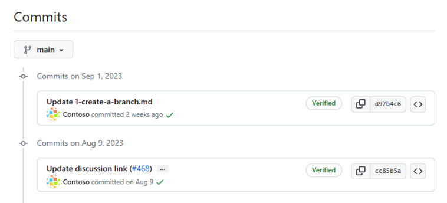
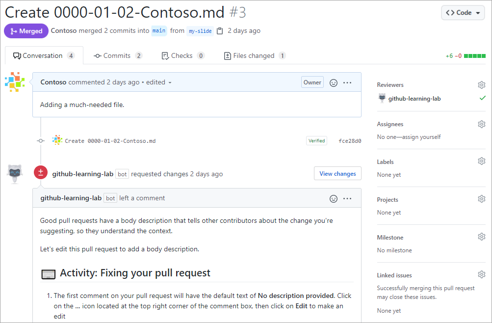

<!-- Copied from 02-Components.md -->
# 🎯 Goal: Learn how GitHub helps you build cool stuff without breaking things.

## 🌿 Branches
Think of branches like alternate timelines in a video game.
You can try wild ideas without messing up the main story.
Mess up? No worries—just rewind or fix it.

You can create a new branch and check it out by using git in a terminal. The command would be
```
git checkout -b newBranchName
```

## 💾 Commits
- Every time you hit save on your code = 💾 commit
- It's like taking a selfie of your work—timestamped, ID'd, and credited to you.
- You can always rewind and see what changed, when, and by who.



## 🔍 File States in Git
Your files go through a glow-up journey:

- Untracked: Git's like "Who dis?"
- Tracked: Git's watching 👀
  - Unmodified: No changes since last commit
  - Modified: You made changes, but haven't staged them
  - Staged: Ready for the spotlight (aka commit)
  - Committed: Locked in the Git vault 🔐

## 🔁 Pull Requests (PRs)
You've made something cool on your branch.
Now you wanna merge it into the main project.
So you open a Pull Request (PR) = "Hey team, check this out!"

Your crew:

- Reviews it 🧐
- Drops comments 💬
- Approves it ✅
- Merges it 🔗



## 🚀 The GitHub Flow (aka the Recipe for Dev Magic)


1. Branch it – Start fresh without breaking main
2. Commit it – Save your progress
3. Pull Request it – Ask for feedback
4. Review it – Tweak and polish
5. Merge it – Into main it goes
6. Delete it – Clean up your branch closet 🧹
