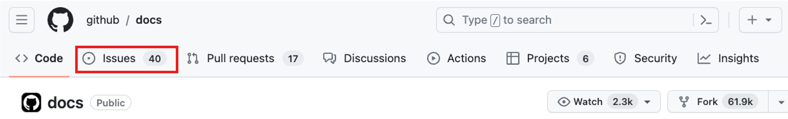
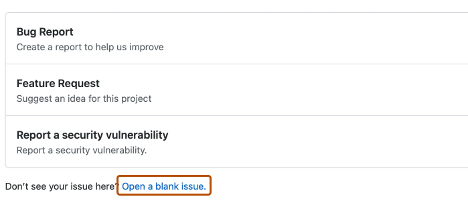
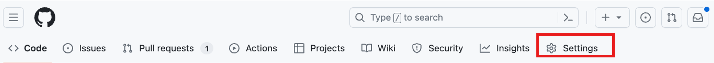
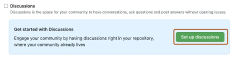
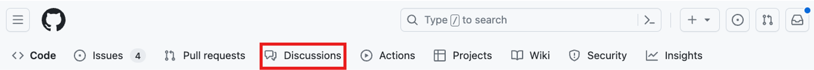
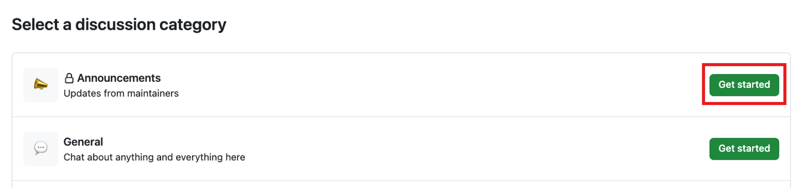
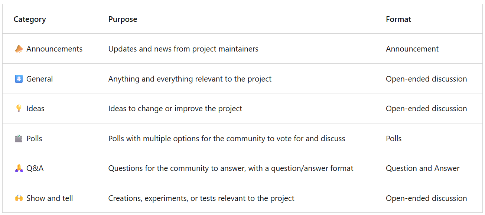
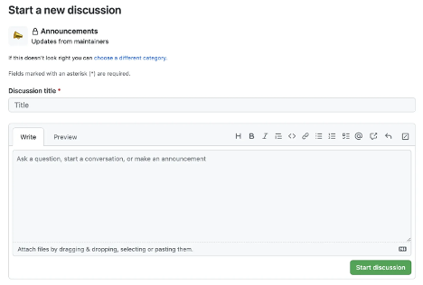

<!-- Copied from 03-Collaboration.md -->
# 🤝 GitHub = Teamwork Playground
GitHub isn't just for code—it's where devs squad up.
You've got repos to organize your stuff,
pull requests to share your changes,
and now… meet the collab power duo:

## 🐛 Issues = To-Do List with Superpowers
Got a bug? Idea? Task? Drop it in an Issue.

You can create one from:

- A task list ✅
- A project note 🗒️
- A comment 💬
- A line of code 💻
- Even a URL 🔗

🛠️ Add a title, describe the problem, assign it, label it, and boom—your team's on it.

## Creating an issue from a repository

1. On GitHub.com, navigate to the main page of the repository.
2. Under your repository name, select **Issues**.

3. Select **New Issue**
4. If your repository uses issue templates, next to the type of issue you'd like to open select **Get started**.

If the type of issue you'd like to open isn't included in the available options, select **Open a blank issue**. If not using templates, skip to Step 5.

5. In the **Add a title** field, enter a title for your issue.
6. In the **Add a description field**, type a description of your issue.
7. If you're a project maintainer, you can assign the issue to someone, add it to a project board, associate it with a milestone, or apply a label.
8. When you're finished, select **Submit new issue**.

## 💬 Discussions = Dev Group Chat Vibes
Not everything's about code.
Sometimes you just wanna talk it out.

Use Discussions for:

- Q&A 🙋
- Ideas 💡
- Announcements 📣
- Polls 🗳️
- Show & Tell 🙌
- General chat 🧃

Set it up in your repo settings, pick a category, and start the convo.

## Enabling a discussion in your repository
🛠️ Who Can Flip the Switch?

- If you own the repo or have Write access, you've got the power to turn on GitHub Discussions—whether your repo is public or private.
- 👀 Visibility? It matches the repo. No surprises.

## 👋 First Time Setup = Welcome Vibes

When you enable Discussions for the first time, GitHub's like:
"Wanna drop a welcome post?"

You can customize it to set the tone for your community—friendly, focused, or full-on fun.

1. On GitHub.com, navigate to the main page of the repository.

2. Under your repository name, select **Settings**.

3. Scroll down to the **Features** section and under **Discussions**, select **Setup discussions**.

4. Under **Start a new discussion**, edit the template to align with the resources and tone you want to set for your community.

5. Select **Start discussion**.

## 💬 Start a New Discussion Like a Pro
If you can see the repo, you can start the chat.
That's right—any logged-in user with access can kick off a discussion.

👥 For orgs? Same deal. If you can view the source repo, you're in.

So go ahead—spark that convo, drop that idea, or ask that burning question.
GitHub's got your back. 💡🔥

1. On GitHub.com, navigate to the main page of the repository or organization where you want to start a discussion.

2. Under your repository or organization name, select **Discussions**.

3. On the right side of the page, select **New discussion**.

4. Select a discussion category by selecting **Get started**. All discussions must be created in a category. For repository discussions, people with maintain or admin permissions to the repository define the categories for discussions in that repository.

## 🗂️ Categories = Organized Chaos (But Make It Cute)

Every Discussion category needs:
- A unique name 🏷️
- A matching emoji 😎
- A clear description so people know what's up 🧠

Why? So convos don't get messy.
You'll know what's a Q&A, what's an idea, and what's just general chat.

🧩 Categories = Filters for the vibe.
Customizable. Sortable. Totally your style.

1. Under **Discussion title** enter a title for your discussion, and under **Write** enter the body of your discussion.

## 🧪 GitHub = Safe Space to Build & Break

With branches, commits, PRs, issues, and discussions, you can test, talk, tweak, and ship—without breaking main.
