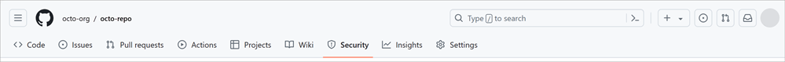
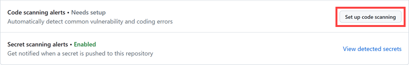

<!-- Copied from 09-CodeScanning.md -->
# Code Scanning

# 🕵️‍♀️ What's Code Scanning?
It's like a security scanner for your code.
GitHub uses CodeQL to sniff out bugs 🐛 and vulnerabilities 🔓 in your repo.
- ✅ Works on public repos
- 🔐 Also works on private org repos (if GitHub Advanced Security is enabled)
- 🚨 Alerts show up in the Security tab
- 🧹 Fix the code → alert disappears

## 🔍 Why It's a Big Deal
- Finds problems early = less chaos later
- Helps you triage + prioritize fixes
- Stops new bugs before they sneak in
- You can schedule scans or trigger them on events like pushes

## 🧠 What's CodeQL?
CodeQL = GitHub's brainy code detective 🧠🔍
It treats code like data and runs smart queries to find issues.

You can set it up 3 ways:

1. Default setup – Fast + easy, runs as a GitHub Action
2. Advanced setup – Full control with a custom workflow
3. External CI – Run CodeQL CLI elsewhere, upload results to GitHub

## 🧬 Supported Languages
CodeQL works with both compiled + interpreted languages:

- C / C++
- C#
- Go
- Java / Kotlin
- JavaScript / TypeScript
- Python
- Ruby
- Swift

## Enable CodeQL in your repository with the Default Setup
If you have write permissions to a repository, you can set up or configure code scanning for that repository.

Follow these steps to set up code scanning using the CodeQL GitHub Actions workflow:

1. On GitHub.com, navigate to the repository's main page.

2. Under your repository name, select **Security**.

3. Select Set up code scanning. If this option isn't available, ask an organization owner or repository administrator to enable GitHub Advanced Security.

4. In the **Set up** drop-down, select **Default**.

5. Review the default options. If needed, select the **Edit** button in the bottom left corner of the new window to customize how CodeQL runs.

The **on:pull_request** and **on:push** triggers are the default for code scanning are each useful for different purposes. 

6. Select Enable CodeQL once you're ready to turn on code scanning.

In the default CodeQL analysis workflow, code scanning is configured to analyze your code each time you either push a change to any protected branches or raise a pull request against the default branch. Once the push is made, code scanning runs automatically.
